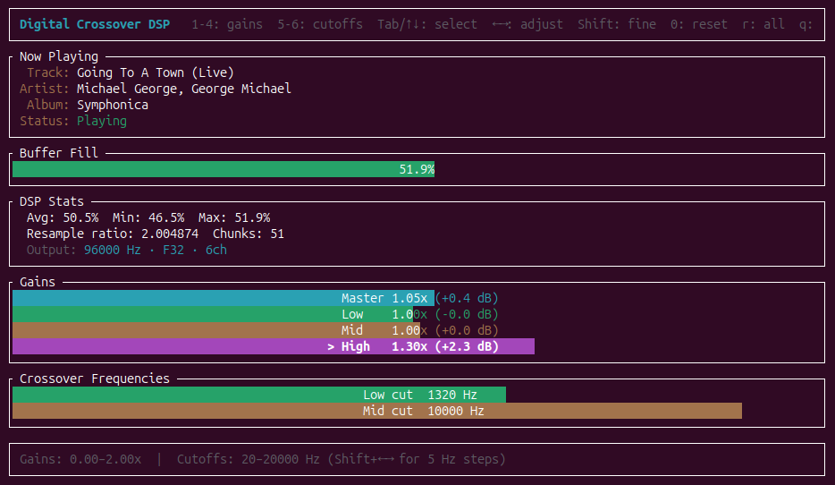

# Digital Crossover DSP



## Overview


## Prerequisites

### Shairport-Sync

#### Installation

https://github.com/mikebrady/shairport-sync/blob/master/BUILD.md

##### Prerequisites

```
apt update
apt upgrade # this is optional but recommended
apt install --no-install-recommends build-essential git autoconf automake libtool \
    libpopt-dev libconfig-dev libasound2-dev avahi-daemon libavahi-client-dev libssl-dev libsoxr-dev \
    libplist-dev libsodium-dev uuid-dev libgcrypt-dev xxd libplist-utils \
    libavutil-dev libavcodec-dev libavformat-dev systemd-dev
```

##### Rust

```
curl --proto '=https' --tlsv1.2 -sSf https://sh.rustup.rs | sh
```

##### NQPTP

```
git clone https://github.com/mikebrady/nqptp.git
cd nqptp
autoreconf -fi # about a minute on a Raspberry Pi.
./configure --with-systemd-startup
make
make install
```

##### ShairPort Sync

```
git clone https://github.com/mikebrady/shairport-sync.git
cd shairport-sync
autoreconf -fi
./configure --sysconfdir=/etc --with-soxr --with-avahi --with-ssl=openssl --with-systemd-startup --with-airplay-2 --with-pipe --with-metadata --without-alsa
make
sudo make install
```

#### Configuration

##### Service Config

```shell
systemctl --user edit shairport-sync
```

```shell
[Service]
PrivateTmp=false
ExecStart=
ExecStart=/usr/local/bin/shairport-sync -o pipe
```

```shell
sudo systemctl daemon-reload
systemctl --user restart shairport-sync
```

##### ShairPort Sync Config

```shell
sudo nano /etc/shairport-sync.conf
```

/etc/shairport-sync.conf
```
general = {
  name = "Digital Crossover";
  ignore_volume_control = "yes";
  output_backend = "pipe";
};

pipe = {
  name = "/tmp/shairport-sync-audio";                   
};

metadata =
{
    enabled = "yes"; // Set this to "yes" to get Shairport Sync to solicit metadata from the source and pass it on via a pipe
    include_cover_art = "yes"; // Set to "yes" to get cover art. "no" is the default.
    pipe_name = "/tmp/shairport-sync-metadata"; // The default name of the pipe where metadata is written.
    pipe_timeout = 5000; // Wait for this many milliseconds before giving up trying to write into the pipe.
};
```

```
systemctl --user enable shairport-sync
systemctl --user start shairport-sync
systemctl --user status shairport-sync
```

#### Testing

```
ffplay -fflags nobuffer -f s32le -ar 48000 -ch_layout stereo /tmp/shairport-sync-audio
```

```
aplay -f S32_LE -r 48000 -c 2 /tmp/shairport-sync-audio
```

```
# sudo apt install sox
play -t raw --buffer 8192 -r 48000 -e signed -b 32 -c 2 -L /tmp/shairport-sync-audio
```

## Installation

```
git clone https://github.com/DirectX/digital-crossover-dsp.git
cd digital-crossover-dsp
make
sudo make install
```

### Architecture

Reader/resampler thread:

Reads S32LE interleaved stereo from pipe at 48 kHz
Accumulates exactly RESAMPLE_CHUNK (1024) frames before processing
Converts i32 to f64 and de-interleaves into per-channel buffers
Before each process() call, computes buffer fill level and adjusts the resampling ratio via set_resample_ratio_relative()
Resamples 48 kHz to 96 kHz using SincFixedIn with sinc interpolation (256-tap, linear interp, BlackmanHarris2 window)
Pushes resampled i32 samples into the lock-free rtrb ring buffer
CPAL output callback (src/main.rs:135-141):

Configured at 96 kHz stereo
Simply pops samples from ring buffer (lock-free, real-time safe)
Buffer-state-driven speed control (src/main.rs:108-111):

fill = 1.0 - producer.slots() / capacity gives current fill ratio (0.0-1.0)
Proportional controller: rel_ratio = 1.0 + (0.5 - fill) * ADJUST_GAIN
Fill > 50% --> ratio decreases slightly --> fewer output samples --> buffer drains
Fill < 50% --> ratio increases slightly --> more output samples --> buffer fills
Clamped within the resampler's allowed range (1/1.01 to 1.01, i.e. +/-1%)
ADJUST_GAIN (0.0005) controls responsiveness -- increase for faster convergence, decrease for smoother output

#### Crossover

src/config.rs: Added OUTPUT_CHANNELS = 6, scaled BUFFER_CAPACITY accordingly, and rebuilt AudioRuntimeConfig with volume, per-band gains (low_gain/mid_gain/high_gain), and placeholder crossover frequencies (low_cut_hz/mid_cut_hz). All fields have serde defaults and a Default impl so partial JSON payloads work.
src/crossover.rs (new): Modular 3-band stereo crossover framework.
BandSplitter trait — pluggable per-channel band split (future FIR/IIR).
PassthroughSplitter — current trivial implementation: feeds full signal to all three bands.
Crossover — owns L/R splitters plus live gains, with update(&cfg) for hot-reload and process(l, r) -> [f32; 6] returning a frame in ALSA surround51 order: FL/FR = low, RL/RR = mid, FC/LFE = high.
src/dsp.rs: Output stream now opens 6 channels at 96 kHz. Inside the main loop, config_rx.has_changed() triggers crossover.update(...) so volumes apply immediately. After resampling, each stereo output frame is fed through Crossover::process and the 6 resulting samples are pushed to the ring buffer.
src/main.rs: Registered crossover module; initial runtime config now uses AudioRuntimeConfig::default().
You can already drive it via the existing POST /update_config endpoint, e.g.:

```shell
curl -X POST http://127.0.0.1:3000/update_config \
  -H 'Content-Type: application/json' \
  -d '{"volume":0.8,"low_gain":1.0,"mid_gain":0.5,"high_gain":0.25,"low_cut_hz":1000,"mid_cut_hz":10000}'
```

#### TUI Update

src/server.rs: Added GET /config which returns the current AudioRuntimeConfig (read via watch::Sender::borrow()), so the TUI (or any client) can pull up-to-date initial values instead of guessing defaults. POST /update_config and GET /status unchanged.
src/tui.rs: Added a full interactive gain panel:
On startup fetches /config to initialize local state.
New "Gains" block shows four gauges (Master / Low / Mid / High) colored distinctly; the selected row is highlighted bold and prefixed with >. Labels show Nx linear plus ± dB.
Footer shows current crossover cutoffs (read-only for now) or last network error.
Keybindings:
Tab / ↓: next control, Shift+Tab / ↑: previous
1/2/3/4 or m: jump to Master/Low/Mid/High
← / -: decrement, → / + / =: increment (step 0.05, with Shift for fine 0.01)
0: reset selected to 1.0, r: reset all to defaults
q / Esc: quit
Every adjustment POSTs the full config to /update_config; errors are shown inline.
Gains are clamped to [0.0, 2.0].

#### Device selection logic

```
let config = device
    .supported_output_configs()
    .expect("Cannot query device configs")
    .filter(|c| c.channels() as usize == OUTPUT_CHANNELS)
    .max_by_key(|c| c.max_sample_rate().0) // выбрать макс. поддерживаемую частоту
    .expect("No 6-channel config found");

let rate = OUTPUT_RATE
    .min(config.max_sample_rate().0)
    .max(config.min_sample_rate().0);

let stream_config = StreamConfig {
    channels: OUTPUT_CHANNELS as u16,
    sample_rate: cpal::SampleRate(rate),
    buffer_size: cpal::BufferSize::Default,
};
```

Review findings & fixes applied
src/config.rs

Removed OUTPUT_RATE — now determined at runtime by device probing
Removed BASE_RATIO — computed locally in run() from the actual selected rate
Removed BUFFER_CAPACITY — same; sized to output_rate * OUTPUT_CHANNELS * 2 at runtime
src/crossover.rs

Crossover::new now takes an explicit sample_rate: f32 parameter instead of pulling OUTPUT_RATE from the const. If you end up on a 96kHz device, filter coefficients are designed at the correct rate. The update() path was unaffected since LrBandSplitter::set_cutoffs reuses the stored sample rate.
src/dsp.rs — select_device

Old behaviour	New behaviour
Returns cpal::Device (panics if none)	Returns Option<(cpal::Device, u32)> — None prints a clear error
Falls back to host.default_output_device() (almost always stereo)	Hard error with actionable message; set DEVICE_NAME in config.rs
Probes only OUTPUT_RATE (48kHz)	Probes [96000, 48000] in order — picks 96kHz if the hardware supports it
is_hdmi() matched "nvidia" and "intel" substrings — false-positives on many real devices	is_hdmi_or_dp() only matches "hdmi", "displayport", "dp,"
No virtual device filter — a 32-channel PipeWire router could be selected	is_honest_hardware(): excludes any device whose max_channels > 8; real 5.1 hw reports ≤ 8
take() closure searched the vec twice	Single `find(...).map(
Device list printed one fixed status string	Prints max_ch, honest, hdmi, and supported rates per device for easier debugging
HDMI/DP used as last-resort fallback only	Added as Priority 3 — an AV receiver over HDMI is a valid 5.1 sink
src/dsp.rs — run()

select_device result handled with early-return None path
buffer_capacity and base_ratio derived from the runtime-selected output_rate
StreamConfig and all log messages use output_rate instead of the old constant
Crossover::new(&cfg, output_rate as f32) passes the actual device rate to filter design