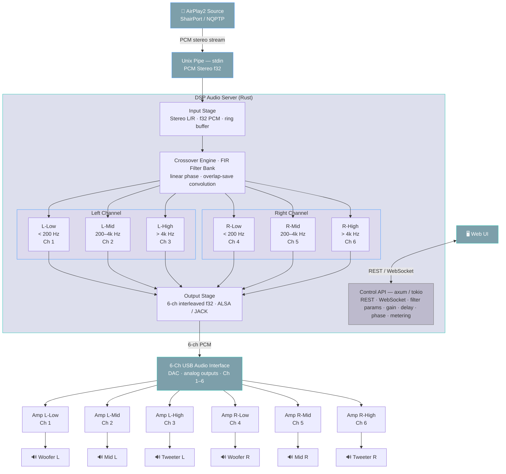

# Digital Crossover DSP

## Overview



## Prerequisites

### Shairport-Sync

#### Installation

https://github.com/mikebrady/shairport-sync/blob/master/BUILD.md

##### Prerequisites

```
apt update
apt upgrade # this is optional but recommended
apt install --no-install-recommends build-essential git autoconf automake libtool \
    libpopt-dev libconfig-dev libasound2-dev avahi-daemon libavahi-client-dev libssl-dev libsoxr-dev \
    libplist-dev libsodium-dev uuid-dev libgcrypt-dev xxd libplist-utils \
    libavutil-dev libavcodec-dev libavformat-dev systemd-dev
```

##### NQPTP

```
git clone https://github.com/mikebrady/nqptp.git
cd nqptp
autoreconf -fi # about a minute on a Raspberry Pi.
./configure --with-systemd-startup
make
make install
```

##### ShairPort Sync

```
git clone https://github.com/mikebrady/shairport-sync.git
cd shairport-sync
autoreconf -fi
./configure --sysconfdir=/etc --with-alsa --with-soxr --with-avahi --with-ssl=openssl --with-systemd-startup --with-airplay-2 --with-pipe
make
sudo make install
```

#### Configuration

##### Service Config

```shell
systemctl --user edit shairport-sync
```

```shell
[Service]
PrivateTmp=false
ExecStart=
ExecStart=/usr/local/bin/shairport-sync -o pipe
```

```shell
sudo systemctl daemon-reload
sudo systemctl restart shairport-sync
```

##### ShairPort Sync Config

```shell
sudo nano /etc/shairport-sync.conf
```

/etc/shairport-sync.conf
```
eneral = {
  name = "My AirPlay";
  ignore_volume_control = "yes";
};

alsa = {
  // Disabling system audio output
};

pipe = {
  name = "/tmp/shairport-sync-audio";  // UNIX pipe path
};

metadata =
{
    enabled = "yes"; // Set this to "yes" to get Shairport Sync to solicit metadata from the source and pass it on via a pipe
    include_cover_art = "yes"; // Set to "yes" to get cover art. "no" is the default.
    pipe_name = "/tmp/shairport-sync-metadata"; // The default name of the pipe where metadata is written.
    pipe_timeout = 5000; // Wait for this many milliseconds before giving up trying to write into the pipe.
};
```

```
systemctl --user enable shairport-sync
systemctl --user start shairport-sync
systemctl --user status shairport-sync
```

#### Testing (possible jitter)

```
ffplay -fflags nobuffer -f s32le -ar 48000 -ch_layout stereo /tmp/shairport-sync-audio
```

```
aplay -f S32_LE -r 48000 -c 2 /tmp/shairport-sync-audio
```

```
# sudo apt install sox
play -t raw --buffer 8192 -r 48000 -e signed -b 32 -c 2 -L /tmp/shairport-sync-audio
```

### Architecture

Reader/resampler thread:

Reads S32LE interleaved stereo from pipe at 44.1 kHz
Accumulates exactly RESAMPLE_CHUNK (1024) frames before processing
Converts i32 to f64 and de-interleaves into per-channel buffers
Before each process() call, computes buffer fill level and adjusts the resampling ratio via set_resample_ratio_relative()
Resamples 44.1 kHz to 96 kHz using SincFixedIn with sinc interpolation (256-tap, linear interp, BlackmanHarris2 window)
Pushes resampled i32 samples into the lock-free rtrb ring buffer
CPAL output callback (src/main.rs:135-141):

Configured at 96 kHz stereo
Simply pops samples from ring buffer (lock-free, real-time safe)
Buffer-state-driven speed control (src/main.rs:108-111):

fill = 1.0 - producer.slots() / capacity gives current fill ratio (0.0-1.0)
Proportional controller: rel_ratio = 1.0 + (0.5 - fill) * ADJUST_GAIN
Fill > 50% --> ratio decreases slightly --> fewer output samples --> buffer drains
Fill < 50% --> ratio increases slightly --> more output samples --> buffer fills
Clamped within the resampler's allowed range (1/1.01 to 1.01, i.e. +/-1%)
ADJUST_GAIN (0.0005) controls responsiveness -- increase for faster convergence, decrease for smoother output
