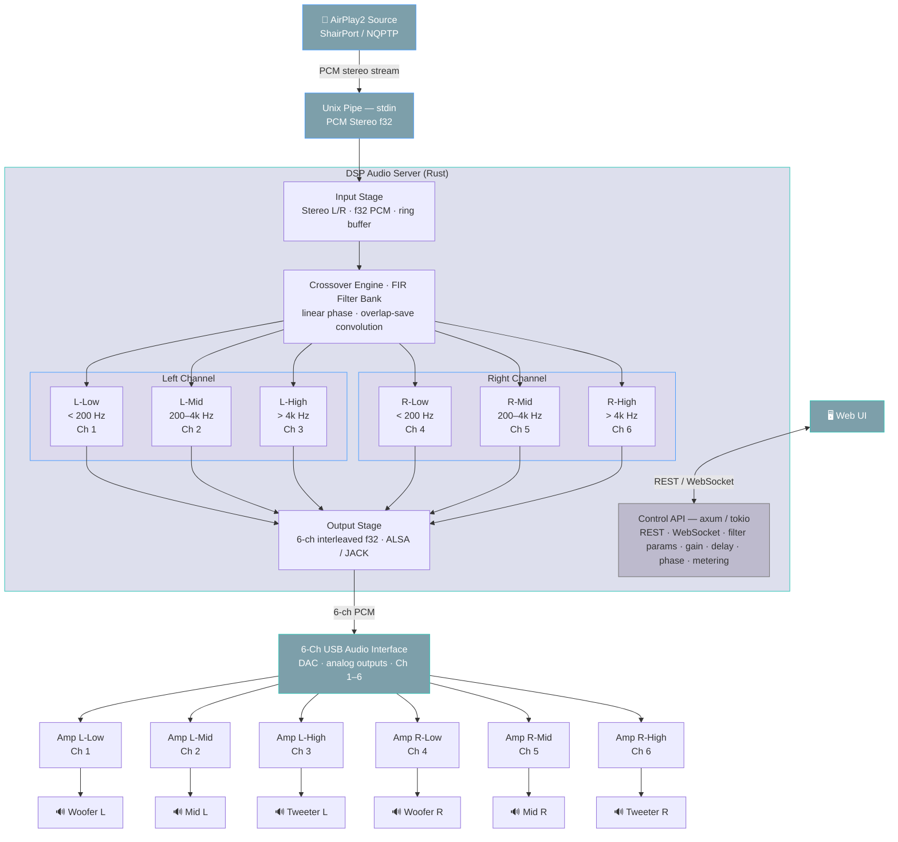

# Digital Crossover DSP

## Overview



## Prerequisites

### Shairport-Sync

#### Installation

https://github.com/mikebrady/shairport-sync/blob/master/BUILD.md

##### Prerequisites

```
apt update
apt upgrade # this is optional but recommended
apt install --no-install-recommends build-essential git autoconf automake libtool \
    libpopt-dev libconfig-dev libasound2-dev avahi-daemon libavahi-client-dev libssl-dev libsoxr-dev \
    libplist-dev libsodium-dev uuid-dev libgcrypt-dev xxd libplist-utils \
    libavutil-dev libavcodec-dev libavformat-dev systemd-dev
```

##### NQPTP

```
$ git clone https://github.com/mikebrady/nqptp.git
$ cd nqptp
$ autoreconf -fi # about a minute on a Raspberry Pi.
$ ./configure --with-systemd-startup
$ make
# make install
```

##### ShairPort Sync

```
git clone https://github.com/mikebrady/shairport-sync.git
cd shairport-sync
autoreconf -fi
./configure --sysconfdir=/etc --with-alsa --with-soxr --with-avahi --with-ssl=openssl --with-systemd-startup --with-airplay-2 --with-pipe
make
sudo make install
```

#### Configuration

```shell
sudo nano /etc/shairport-sync.conf
```

/etc/shairport-sync.conf
```
eneral = {
  name = "My AirPlay";
  ignore_volume_control = "yes";
};

// Отключаем вывод на системное устройство, используем pipe
alsa = {
  // Disabling system audio output
};

pipe = {
  name = "/tmp/shairport-sync-audio";  // UNIX pipe path
};
```

```
systemctl --user enable shairport-sync
systemctl --user start shairport-sync
systemctl --user status shairport-sync
```

#### Testing (possible jitter)

```
ffplay -fflags nobuffer -f s32le -ar 44100 -ch_layout stereo /tmp/shairport-sync-audio
```

```
aplay -f S32_LE -r 44100 -c 2 /tmp/shairport-sync-audio
```

```
# sudo apt install sox
play -t raw --buffer 8192 -r 44100 -e signed -b 32 -c 2 -L /tmp/shairport-sync-audio
```
